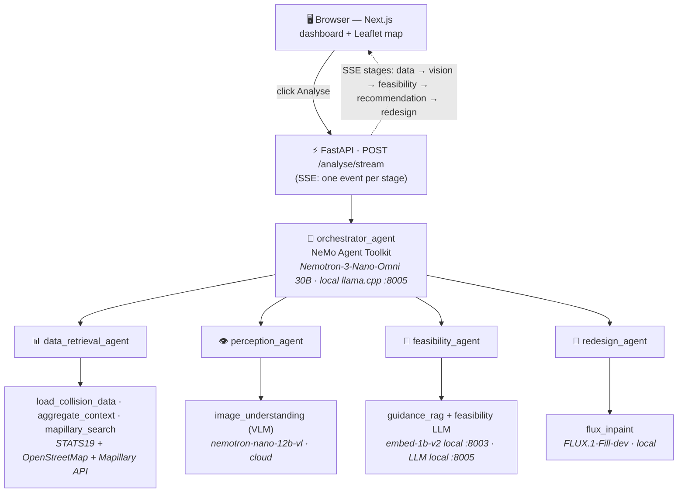

<h1>LondonZero — AI Road Safety Analyst & Junction Redesigner</h1>

> A multi-agent system that analyses why a London junction is dangerous and generates an
> evidence-based, visually-rendered redesign — turning collision data, street imagery, and
> road-design policy into actionable recommendations for city planners.

LondonZero supports London's **Vision Zero** goal (eliminate death and serious injury on the
transport network by 2041). Point it at a junction and it produces: a collision risk profile,
a vision-based hazard assessment of the actual street, a feasibility-checked intervention brief
grounded in design guidance, and a generated "after" image of the safer junction.

**Built on:** the [NVIDIA Video Search and Summarization (VSS) Blueprint](https://github.com/NVIDIA-AI-Blueprints/video-search-and-summarization)
and the [NVIDIA NeMo Agent Toolkit (NAT)](https://docs.nvidia.com/nat/). We forked the blueprint's
agent-toolkit scaffolding and tool-registration patterns as our starting point, then built an entirely
new agent package (`agent/src/londonzero_agents/`) for the road-safety domain. The original blueprint
docs are preserved under [`docs/`](docs/) and the upstream `vss_agents` package remains in the tree for reference.

---

## Table of Contents
- [Demo Flow](#demo-flow)
- [Architecture](#architecture)
- [Tech Stack](#tech-stack)
- [Quick Start](#quick-start)
- [Reproducing the Demo](#reproducing-the-demo)
- [Datasets & Provenance](#datasets--provenance)
- [Known Limitations & Next Steps](#known-limitations--next-steps)
- [Repository Structure](#repository-structure)
- [License](#license)

---

## Demo Flow

1. Open the dashboard, click a London junction on the map (MVP target: **Bank Junction**).
2. Hit **Analyse**. The pipeline streams its progress stage-by-stage over Server-Sent Events:

| # | Stage | Agent | What it does |
|---|-------|-------|--------------|
| 1 | **Data** | `data_retrieval_agent` | Pulls STATS19 collision stats + OpenStreetMap context for the junction, and a Mapillary street-level photo |
| 2 | **Vision** | `perception_agent` | A VLM inspects the photo for hazards, missing infrastructure, and visibility issues |
| 3 | **Feasibility** | `feasibility_agent` | RAG over road-design guidance produces a constraint-aware intervention brief |
| 4 | **Recommendation** | `orchestrator_agent` | Synthesises everything into a plain-language recommendation |
| 5 | **Redesign** | `redesign_agent` | FLUX inpainting renders an "after" image of the safer junction |

The dashboard shows the live progress, the before/after imagery, and the recommendation.

## Architecture



- **Orchestration:** NVIDIA NeMo Agent Toolkit (`nvidia-nat`). Each agent/tool is a NAT component
  discovered via entry points; agents compose by invoking each other's typed `FunctionInfo`.
- **Transport:** FastAPI exposes `POST /analyse/stream` (SSE, one structured event per stage) and `GET /health`.
- **Portability:** every model endpoint in `agent/configs/londonzero.yml` is an env-overridable
  `${VAR:-cloud-default}`, so the same config runs fully on cloud (NVIDIA API Catalog) or fully/partly
  on local GPUs with no code change.

## Tech Stack

| Layer | Choice |
|-------|--------|
| **Agent framework** | NVIDIA NeMo Agent Toolkit (`nvidia-nat` 1.5.0a) + LangGraph |
| **API** | FastAPI + Server-Sent Events, served by uvicorn |
| **Frontend** | Next.js (Pages Router) + React + Leaflet map, in a Turbo monorepo |
| **Orchestrator + Feasibility LLM** | `NVIDIA-Nemotron-3-Nano-Omni-30B-A3B` (Q4 GGUF) via **local** llama.cpp on `:8005` |
| **Perception VLM** | `nvidia/nemotron-nano-12b-v2-vl` (cloud NVIDIA API Catalog) |
| **RAG embeddings** | `nvidia/llama-nemotron-embed-1b-v2` via **local** NIM on `:8003` |
| **Image generation** | `black-forest-labs/FLUX.1-Fill-dev` inpainting, **local** (diffusers) |
| **Hardware** | NVIDIA DGX Spark / GB10 (aarch64, CUDA 13) |
| **Python tooling** | `uv` (provisions Python 3.13+) |

> Models can all run on the NVIDIA API Catalog instead — just leave the local env overrides unset.

## Quick Start

Prerequisites: [`uv`](https://docs.astral.sh/uv/) (`curl -LsSf https://astral.sh/uv/install.sh | sh`),
Node.js 18+, and an `.env` (see [Reproducing the Demo](#reproducing-the-demo)).

**1. Backend — the agent API**

```bash
cd agent
set -a && . ../.env && set +a              # load API keys + (optional) local model endpoints
uv run uvicorn londonzero_agents.api.server:app --host 0.0.0.0 --port 8000
```

Wait for `Application startup complete`. Check it: `curl http://localhost:8000/health` → `{"status":"ok"}`.
If you see `[Errno 98] address already in use`, an instance is already running — reuse it or pass a different `--port`.

**2. Frontend — the dashboard**

```bash
cd ui
npm install                                # first run only (installs turbo + workspace deps)
npm run dev -w londonzero-ui               # serves http://localhost:3000
```

Open <http://localhost:3000>, click a junction, click **Analyse**.

> Run the workspace directly (`-w londonzero-ui`), **not** the root `npm run dev` — the latter also tries
> to build the upstream NVIDIA `vss-ui` packages and emits unrelated build errors.

**Optional — running the LLMs locally on a GPU box (DGX Spark / GB10):**

```bash
# Orchestrator + feasibility LLM (Nemotron-3-Nano-Omni 30B GGUF)
~/llama.cpp/llama-server -m ~/unsloth/NVIDIA-Nemotron-3-Nano-Omni-30B-A3B-Reasoning-GGUF/<model>.gguf \
  --host 0.0.0.0 --port 8005 -c 8192 -ngl 999 --jinja
# Embeddings NIM on :8003 (docker) — see nim-compose.yml
```

Then add the local endpoints to `.env` (see sample below) and restart the API.

## Reproducing the Demo

**1. Secrets — create `.env` in the repo root.** A sample is below (and in [`.env.example`](.env.example)):

```bash
# ── Required ─────────────────────────────────────────────────────────────────
NVIDIA_API_KEY=nvapi-...            # https://build.nvidia.com — for cloud models + embeddings
MAPILLARY_ACCESS_TOKEN="MLY|...|..."  # https://www.mapillary.com/dashboard/developers — street imagery

# ── Optional: run models locally (omit any line to use the cloud default) ─────
# Orchestrator + feasibility LLM (llama.cpp on :8005)
ORCH_LLM_BASE_URL=http://localhost:8005/v1
ORCH_LLM_MODEL=NVIDIA-Nemotron-3-Nano-Omni-30B-A3B-Reasoning-UD-Q4_K_XL.gguf
# Embeddings NIM on :8003
EMBED_BASE_URL=http://localhost:8003/v1
# Local VLM (only if you serve one; default is cloud)
# VLM_BASE_URL=http://localhost:8002/v1/chat/completions
```

To run **fully on cloud**, set only `NVIDIA_API_KEY` and `MAPILLARY_ACCESS_TOKEN` and omit the rest.

**2. Frontend → backend URL.** By default the UI calls the API on the same host it was loaded from,
port 8000. To pin it explicitly (e.g. accessing the dashboard from another device on the LAN),
create `ui/apps/londonzero-ui/.env.local`:

```bash
NEXT_PUBLIC_API_URL=http://<server-ip>:8000
```

**3. Data.** Place the dataset files at the paths in [Datasets & Provenance](#datasets--provenance) below
(they are excluded from the repo to avoid large blobs).

**4. CLI smoke test (no UI):**

```bash
cd agent && set -a && . ../.env && set +a
uv run nat run --config_file configs/londonzero.yml \
  --input "Why is this junction risky and what would make it safer?"
```

## Datasets & Provenance

All data is **real, public, open-licensed** — no synthetic data is used in the analysis path.
Files live under `data/` and are read at the exact paths below (configurable in `agent/configs/londonzero.yml`).

| Dataset | Path | Source / Provenance | Used for |
|---------|------|---------------------|----------|
| **STATS19 road safety data** (collisions, casualties, vehicles — last 5 years) | `data/stats19/{collision,casualty,vehicle}-last-5-years.csv` | UK Department for Transport (DfT), [data.gov.uk](https://www.data.gov.uk/dataset/cb7ae6f0-4be6-4935-9277-47e5ce24a11f/road-safety-data) (Open Government Licence). Filtered to City of London, LA code `E09000001`. | Collision risk profile (counts, severity, cyclist/pedestrian %, dominant manoeuvre) |
| **OpenStreetMap — Greater London extract** | `data/osm/greater-london-latest.osm.pbf` | [Geofabrik](https://download.geofabrik.de/europe/united-kingdom/england/greater-london.html) (OpenStreetMap, ODbL). Parsed with `pyosmium`. | Junction context: traffic signals, crossings, cycle infrastructure, nearby roads & speed limits |
| **Mapillary street-level imagery** | fetched live via API | [Mapillary](https://www.mapillary.com/) API (CC-BY-SA), keyed by `MAPILLARY_ACCESS_TOKEN` | The street photo the perception VLM analyses |
| **Road-design guidance corpus (RAG)** | `data/rag/` | Public UK active-travel / road-design guidance (e.g. LTN 1/20, TfL Cycling Design Standards / CID). | Grounding the feasibility brief's recommendations in real policy |

> These files are git-excluded on this branch to keep it pushable — see the run notes; download them
> from the sources above into the listed paths before running end-to-end.

## Known Limitations & Next Steps

**Known limitations (hackathon MVP):**
- **Single junction focus.** Bank Junction (51.5133, -0.0886) is the validated demo target; other
  junctions work but are less tuned.
- **One street image.** The perception stage uses a single Mapillary frame (treated as a one-frame
  "video"), not a multi-view or temporal sweep.
- **Maskless redesign.** FLUX does full-image inpainting from a text prompt — there's no segmentation
  mask, so the "after" image is illustrative, not a survey-accurate render. The prompt also exceeds
  CLIP's 77-token limit (T5 still receives the full prompt).
- **Latency.** A full run is ~2–3 min end-to-end; the FLUX redesign (~30 steps) dominates.
- **Reasoning model quirks.** The local Nemotron orchestrator returns chain-of-thought in a separate
  `reasoning_content` field; tooling must read `content` only.
- **Session memory** is in-process (`InMemorySaver`) — fine for a demo, not multi-user/persistent.
- **No guardrail agent** in the MVP path.

**Next steps:**
- Multi-image / panoramic perception and before/after geo-alignment.
- Mask-guided inpainting (segment the carriageway/footway) for accurate redesigns.
- Batch/borough-wide scoring to rank the most dangerous junctions automatically.
- Serve the perception VLM locally (the Nano-Omni GGUF ships an `mmproj`, so one llama-server could do vision too).
- Persistent storage + planner-facing report export (PDF), and the stretch-goal voice walkthrough.

## Repository Structure

| Directory | Description |
|-----------|-------------|
| `agent/` | Python agent service. Our code is in `src/londonzero_agents/` (`agents/`, `tools/`, `api/`, `pipeline.py`, `data_models/`). The upstream blueprint's `vss_agents/` is retained for reference. |
| `ui/` | Turbo monorepo. Our dashboard is `apps/londonzero-ui/` (Next.js + Leaflet). Other `apps/`/`packages/` are upstream NVIDIA UI components. |
| `data/` | Local datasets (`stats19/`, `osm/`, `rag/`) — see [Datasets & Provenance](#datasets--provenance). |
| `configs/`, `config/` | Workflow + model configuration (`agent/configs/londonzero.yml`). |
| `nim-compose.yml` | Docker Compose for the local NVIDIA NIM microservices (embeddings, etc.). |
| `docs/`, `skills/`, `deployments/`, `scripts/` | Inherited from the NVIDIA VSS blueprint — reference material and deployment assets. |

## License

This project builds on the NVIDIA VSS Blueprint. See [LICENSE](LICENSE), [LICENSE.md](LICENSE.md),
and third-party notices in [LICENSE-3rd-party.txt](LICENSE-3rd-party.txt). Dataset licences are listed
in [Datasets & Provenance](#datasets--provenance).
